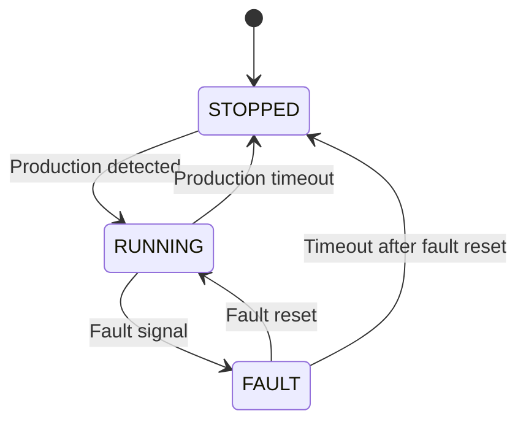

# Machine State Machine

```mermaid
stateDiagram-v2

[*] --> STOPPED

STOPPED --> RUNNING : Production detected

RUNNING --> FAULT : Fault signal

FAULT --> RUNNING : Fault reset

RUNNING --> STOPPED : Production timeout

FAULT --> STOPPED : Timeout after fault reset
```

## State Priority

1. FAULT
2. RUNNING
3. STOPPED

The dashboard always displays the latest machine state stored in the `machine_status` table.